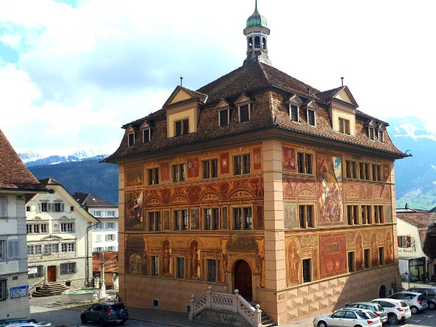

Visiting all 26 county capitals of Switzerland by train.

---

Nach der Monopoly-Reise vom letzten Jahr [www.kalberer.org/monopoly](https://www.kalberer.org/monopoly/) folgt morgen die erste von drei Tagesetappen an alle Kantonshauptorte der Schweiz [#swisstour](.)

(Originally on Twitter: [Thu Jan 03 20:08:28 2019](https://twitter.com/implgeo/status/1080888642577596416))

---

[#swisstour](.) Ostschweiz has started. Goal: visiting all 26 county capitals of Switzerland by train.

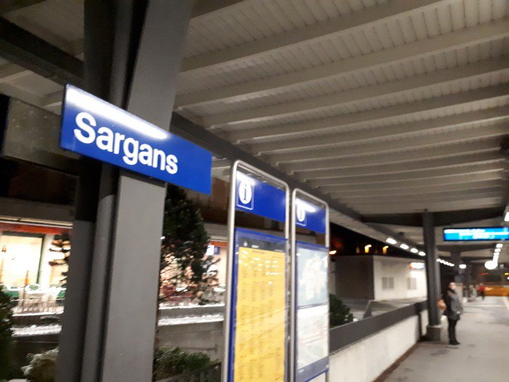

(Originally on Twitter: [Fri Jan 04 8:13:21 2019](https://twitter.com/implgeo/status/1081071065466580992))

---

[#swisstour](.) 1/26: Appenzell, Kanton Appenzell Innerrhoden [www.ai.ch/politik](https://www.ai.ch/politik)

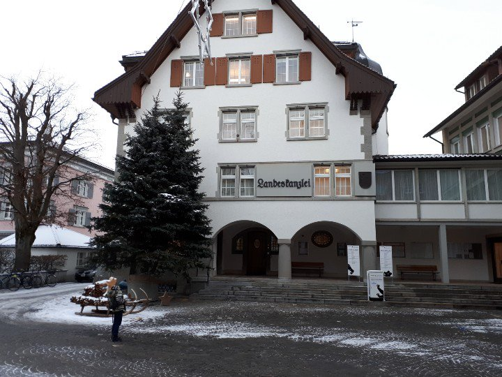

(Originally on Twitter: [Fri Jan 04 9:48:01 2019](https://twitter.com/implgeo/status/1081094885980151809))

---

[#swisstour](.) 2/26: Regierungsgebäude Herisau, Kanton Appenzell Ausserrhoden [www.ar.ch/kantonsrat](https://www.ar.ch/kantonsrat/)

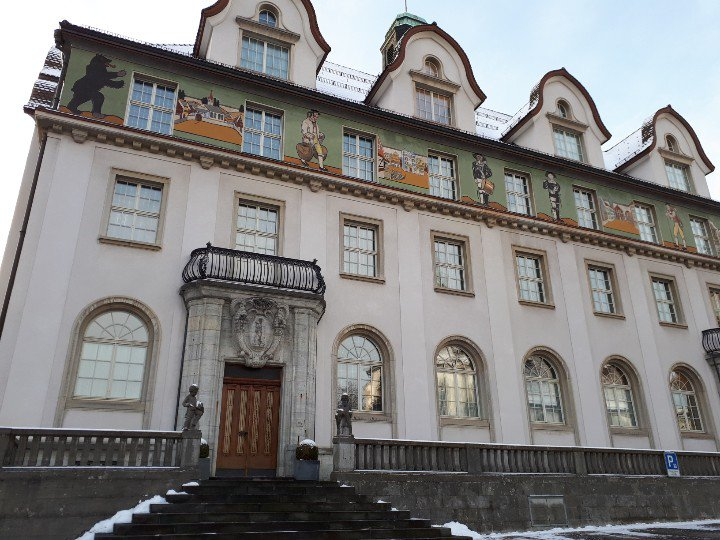

(Originally on Twitter: [Fri Jan 04 11:14:58 2019](https://twitter.com/implgeo/status/1081116770428248065))

---

[#swisstour](.) 3/26: Rathaus Glarus, Kanton Glarus

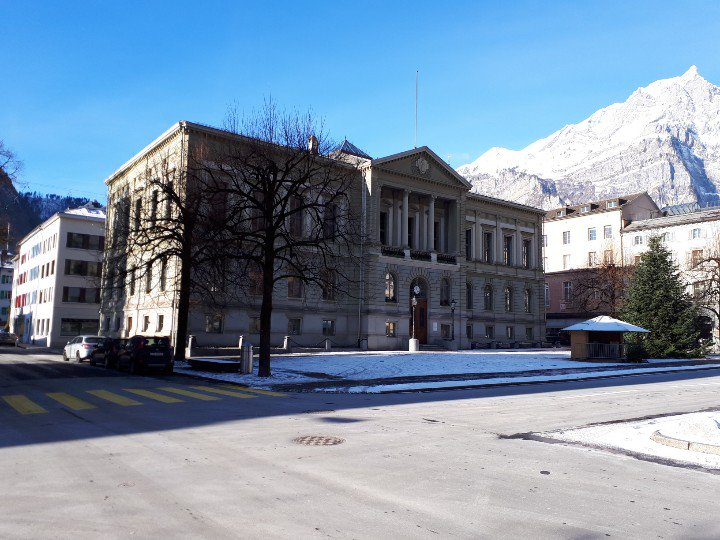

(Originally on Twitter: [Fri Jan 04 12:45:26 2019](https://twitter.com/implgeo/status/1081139536514768896))

---

[#swisstour](.) 4/26: Rathaus Zürich, Kanton Zürich [www.kantonsrat.zh.ch](https://www.kantonsrat.zh.ch/kurz-erklaert/der-kantonsrat-kurz-erklaert.aspx)

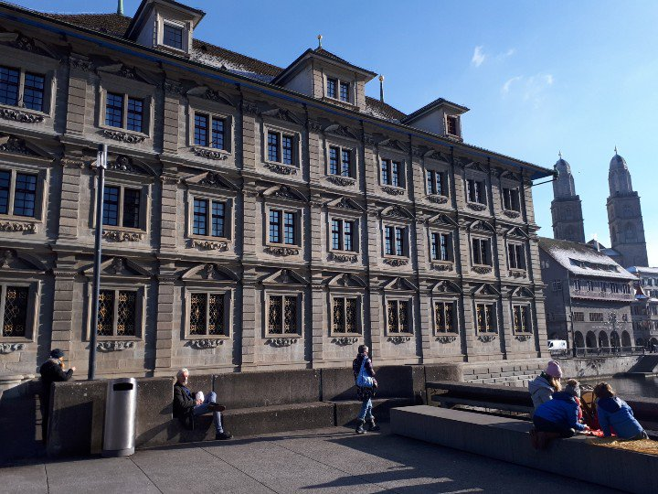

(Originally on Twitter: [Fri Jan 04 14:31:19 2019](https://twitter.com/implgeo/status/1081166182311432192))

---

[#swisstour](.) 5/26: Rathaus Schaffhausen, Kanton Schaffhausen [wikipedia.org](https://de.wikipedia.org/wiki/Kantonsrat_(Schaffhausen))

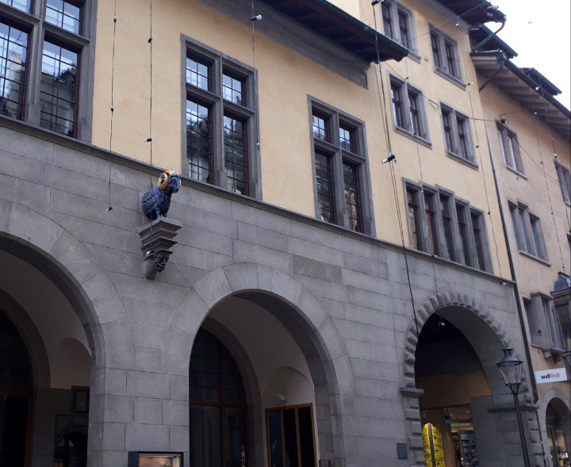

(Originally on Twitter: [Fri Jan 04 15:51:41 2019](https://twitter.com/implgeo/status/1081186406553317376))

---

[#swisstour](.) 6/26: Rathaus Frauenfeld, Kanton Thurgau [wikipedia.org](https://de.wikipedia.org/wiki/Grosser_Rat_(Thurgau))

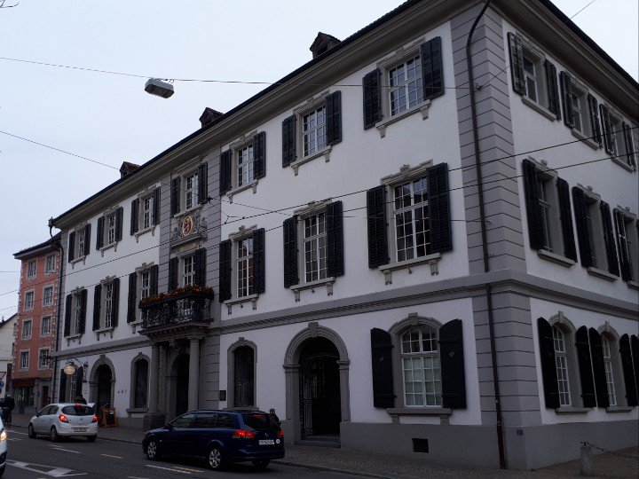

(Originally on Twitter: [Fri Jan 04 16:51:40 2019](https://twitter.com/implgeo/status/1081201503791210501))

---

[#swisstour](.) 7/26: Kantonsratssaal im Klosterbezirk St. Gallen, Kanton St. Gallen
[www.sg.ch](https://www.sg.ch/politik-verwaltung/kantonsrat/der-kantonsrat-kurz-erklaert/der-kantonsratssaal.html)

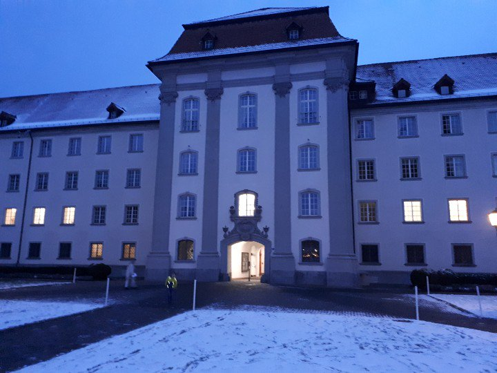

(Originally on Twitter: [Fri Jan 04 18:31:30 2019](https://twitter.com/implgeo/status/1081226626267004928))

---

[#swisstour](.) 8/26: Grossratsgebäude Chur, Kanton Graubünden. [wikipedia.org](https://de.wikipedia.org/wiki/Grosser_Rat_(Graub%C3%BCnden))

Etappe 1 ist geschafft! Etappen 2+3 folgen später.

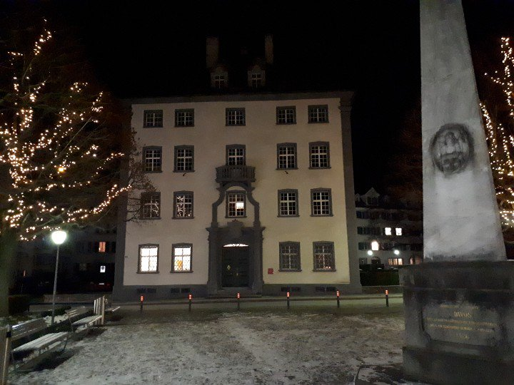

(Originally on Twitter: [Fri Jan 04 20:27:06 2019](https://twitter.com/implgeo/status/1081255718563598338))

---

6:28: Start zu Etappe 2+3 der [#swisstour](.) - Reise zu allen Kantonshauptorten der Schweiz 🇨🇭 in 3 Tagen.

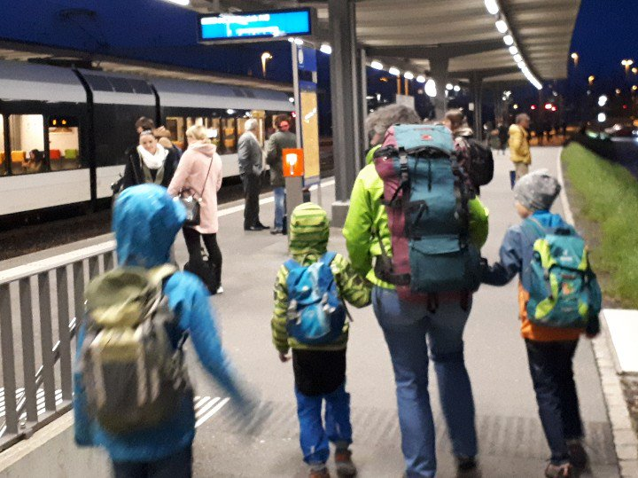

(Originally on Twitter: [Mon Apr 08 6:49:17 2019](https://twitter.com/implgeo/status/1115114368365146112))

---

[#swisstour](.) 9/26: Rathaus Basel, Kanton Basel Stadt

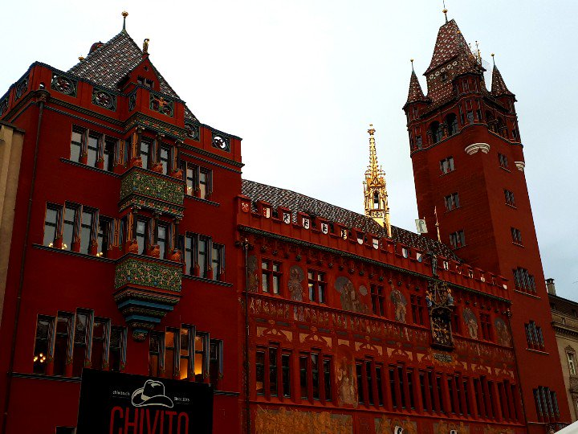

(Originally on Twitter: [Mon Apr 08 9:18:38 2019](https://twitter.com/implgeo/status/1115151953544269824))

---

[#swisstour](.) 10/26: Parlement Delémont, Kanton Jura

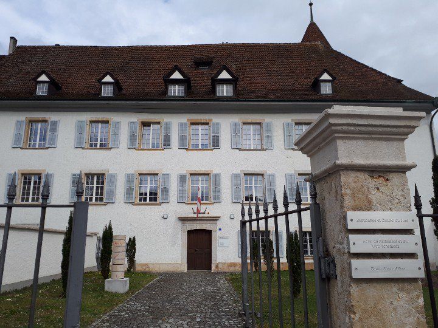

(Originally on Twitter: [Mon Apr 08 10:46:40 2019](https://twitter.com/implgeo/status/1115174107363119105))

---

[#swisstour](.) 11/26: Rathaus Solothurn, Kanton Solothurn

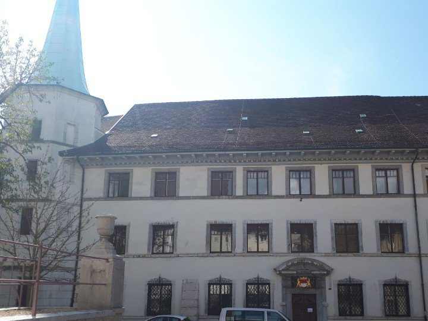

(Originally on Twitter: [Mon Apr 08 11:55:58 2019](https://twitter.com/implgeo/status/1115191546775842816))

---

[#swisstour](.) 12/26: Château Neuchâtel, Kanton Neuenburg

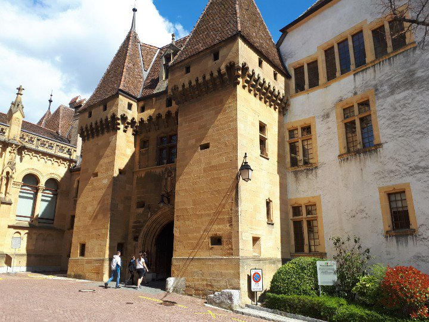

(Originally on Twitter: [Mon Apr 08 13:13:54 2019](https://twitter.com/implgeo/status/1115211158200508418))

---

[#swisstour](.) 13/26: Grand Conseil Lausanne, Kanton Waadt

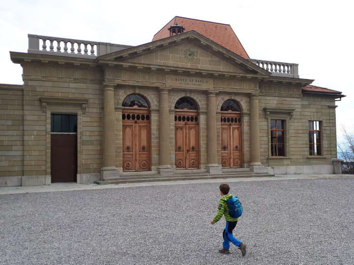

(Originally on Twitter: [Mon Apr 08 14:58:50 2019](https://twitter.com/implgeo/status/1115237565815250947))

---

[#swisstour](.) 14/26: Hôtel de Ville Genève, Kanton Genf

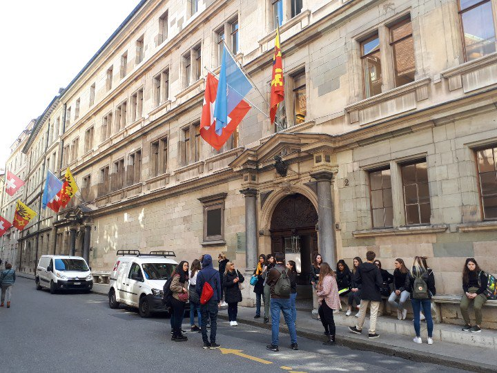

(Originally on Twitter: [Mon Apr 08 15:32:13 2019](https://twitter.com/implgeo/status/1115245965684957184))

---

[#swisstour](.) 15/26: Grand Conseil Sion, Kanton Wallis

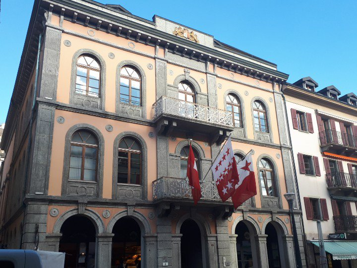

(Originally on Twitter: [Mon Apr 08 18:44:12 2019](https://twitter.com/implgeo/status/1115294279772123137))

---

Approaching Lausanne for the 3rd time today. Better prepared to take a picture of Château Chillon from the train this time. [#swisstour](.) @foss4g

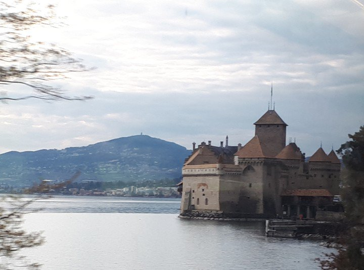

(Originally on Twitter: [Mon Apr 08 18:51:09 2019](https://twitter.com/implgeo/status/1115296030277423106))

---

[#swisstour](.) 16/26: Grand Conseil Fribourg, Kanton Freiburg

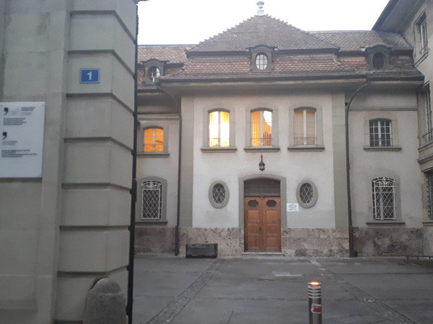

(Originally on Twitter: [Mon Apr 08 20:33:35 2019](https://twitter.com/implgeo/status/1115321807266111491))

---

Overnight stay with an appropriate view:  the National Parliament in the Swiss capital Bern [#swisstour](.)

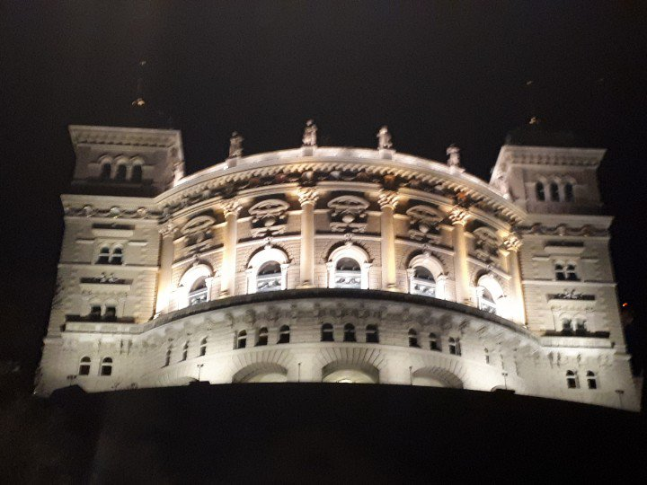

(Originally on Twitter: [Mon Apr 08 21:39:15 2019](https://twitter.com/implgeo/status/1115338334203727873))

---

Dritte Etappe [#swisstour](.) 17/26: Rathaus Bern, Kanton Bern

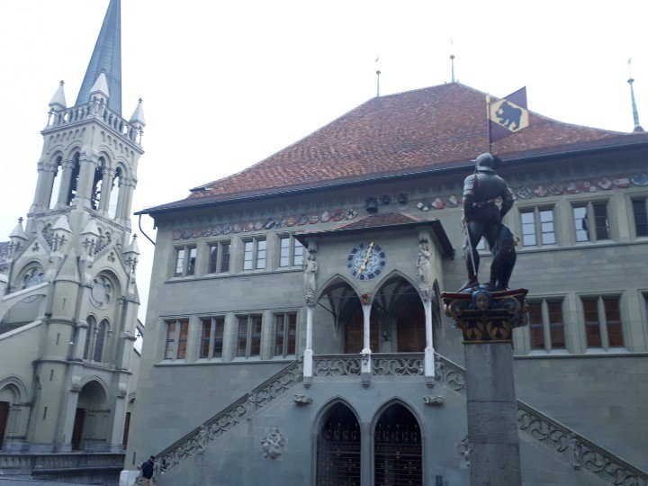

(Originally on Twitter: [Tue Apr 09 7:35:41 2019](https://twitter.com/implgeo/status/1115488432480976897))

---

[#swisstour](.) 18/26: Regierungsgebäude Liestal, Kanton Basel-Land

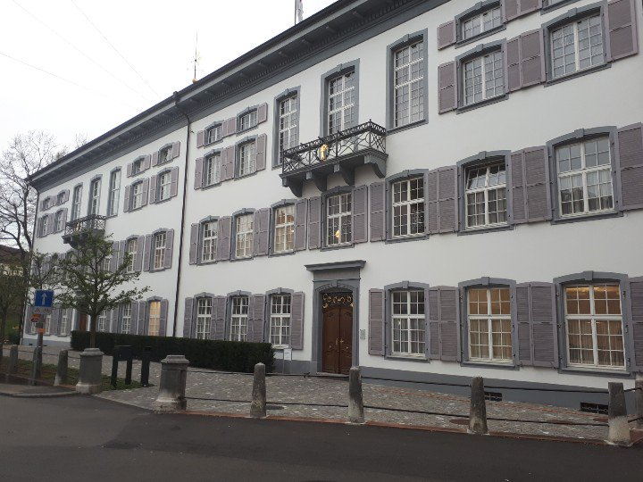

(Originally on Twitter: [Tue Apr 09 9:02:15 2019](https://twitter.com/implgeo/status/1115510215833739264))

---

[#swisstour](.) 19/26: Grossratsgebäude Aarau, Kanton Aargau

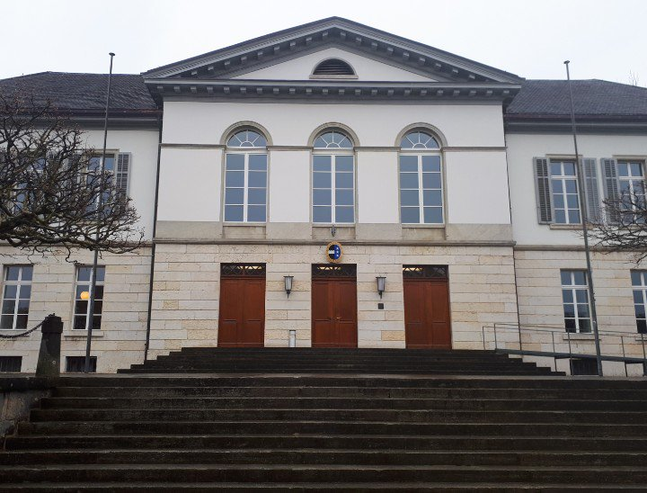

(Originally on Twitter: [Tue Apr 09 9:52:32 2019](https://twitter.com/implgeo/status/1115522871475019776))

---

[#swisstour](.) 20/26: Regierungsgebäude Luzern, Kanton Luzern

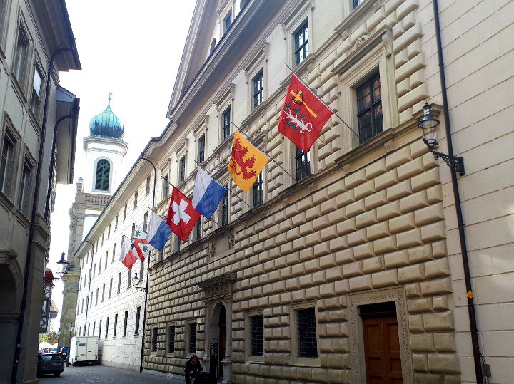

(Originally on Twitter: [Tue Apr 09 11:21:34 2019](https://twitter.com/implgeo/status/1115545278956888064))

---

[#swisstour](.) 21/26: Rathaus Sarnen, Kanton Obwalden

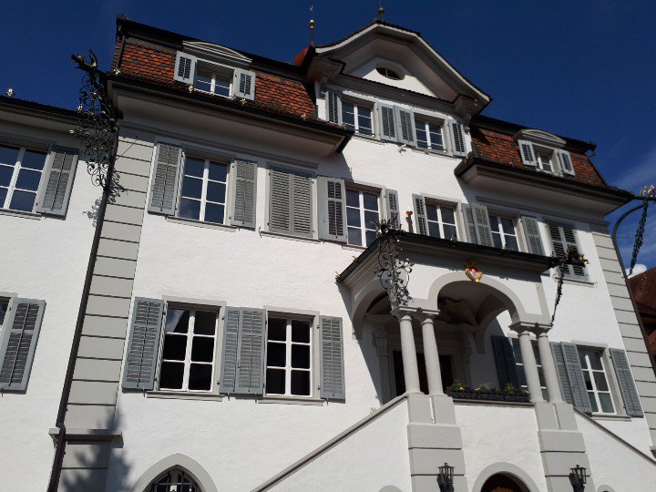

(Originally on Twitter: [Tue Apr 09 12:21:05 2019](https://twitter.com/implgeo/status/1115560255402983424))

---

[#swisstour](.) 21/26: Rathaus Stans, Kanton Nidwalden

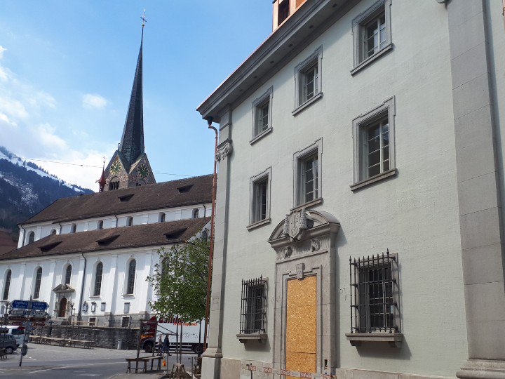

(Originally on Twitter: [Tue Apr 09 13:06:35 2019](https://twitter.com/implgeo/status/1115571707300012032))

---

[#swisstour](.) 23/26: Regierungsgebäude Zug, Kanton Zug

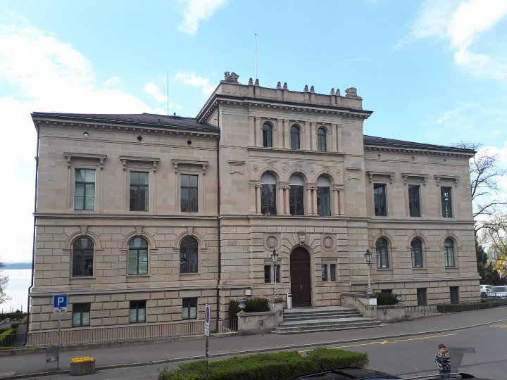

(Originally on Twitter: [Tue Apr 09 15:06:37 2019](https://twitter.com/implgeo/status/1115601912307388423))

---

[#swisstour](.) 24/26: Rathaus Schwyz, Kanton Schwyz

(Originally on Twitter: [Tue Apr 09 16:06:31 2019](https://twitter.com/implgeo/status/1115616986308988934))

---

[#swisstour](.) 25/26: Rathaus Altdorf, Kanton Uri

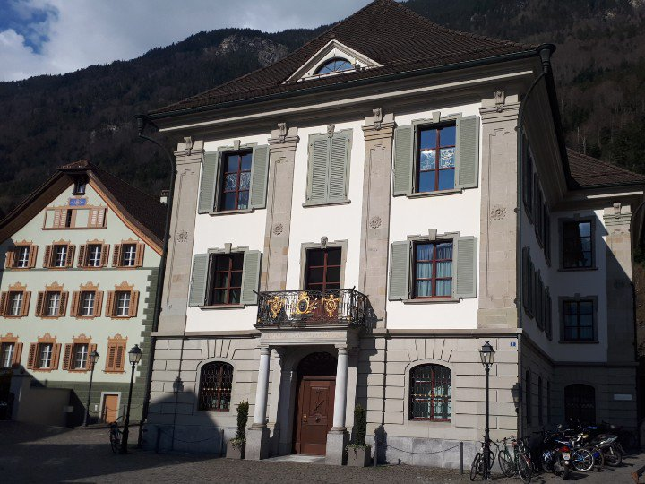

(Originally on Twitter: [Tue Apr 09 17:17:28 2019](https://twitter.com/implgeo/status/1115634843046547456))

---

🎉🎉🎉 [#swisstour](.) 26/26: Palazzo delle Orsoline Bellinzona, Kanton Tessin 🇨🇭🇨🇭🇨🇭

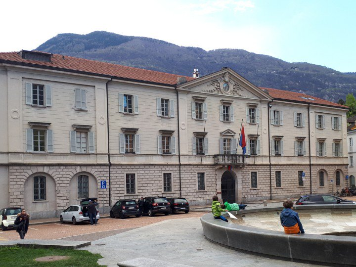

(Originally on Twitter: [Tue Apr 09 18:17:17 2019](https://twitter.com/implgeo/status/1115649897489940482))
